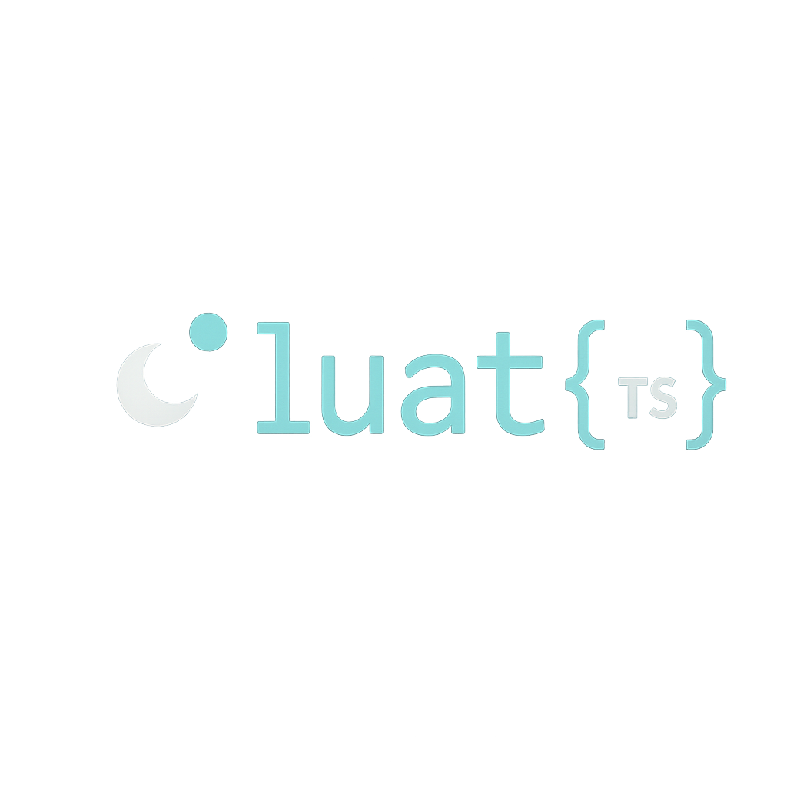

<div align="center">
  
</div>

<div align="center">

[](https://www.npmjs.org/package/luats)
[](https://github.com/codemeapixel/luats/actions)
[](https://npm-stat.com/charts.html?package=luats)
[](https://github.com/codemeapixel/luats/blob/master/LICENSE)
[](https://makeapullrequest.com)

</div>

<p align="center">
  <b>A TypeScript library for parsing, formatting, and providing type interfaces for Lua and Luau code.</b>
  <br>
  <a href="https://luats.lol"><strong>Explore the docs »</strong></a>
  <br>
  <br>
  <a href="https://luats.lol/examples">View Examples</a>
  ·
  <a href="https://github.com/codemeapixel/luats/issues/new?labels=bug&template=bug_report.md">Report Bug</a>
  ·
  <a href="https://github.com/codemeapixel/luats/issues/new?labels=enhancement&template=feature_request.md">Request Feature</a>
  ·
  <a href="https://github.com/codemeapixel/luats/security/policy">Security</a>
</p>

## 🌟 What is LuaTS?

LuaTS bridges the gap between Lua/Luau and TypeScript ecosystems, allowing developers to leverage type safety while working with Lua codebases. Whether you're developing Roblox games, working with embedded Lua, or maintaining legacy Lua code, LuaTS helps you generate accurate TypeScript definitions for better IDE support, type checking, and developer experience.

> [!CAUTION]
> This lib is still a work in progress, as such you WILL NOT find it on NPM yet!

## ✨ Features

### 🔁 **Core Parsing & Generation**
- **Parse standard Lua and Luau code** into Abstract Syntax Trees (AST)
- **Convert Luau type declarations into TypeScript interfaces**
- **Format Lua/Luau code** with customizable styling options
- **Comprehensive AST manipulation** with full type definitions

### 🧠 **Advanced Type System**
- **Maps Lua types to TypeScript equivalents** (`string`, `number`, `boolean`, `nil` → `null`)
- **Optional types** (`foo: string?` → `foo?: string`)
- **Array types** (`{string}` → `string[]`)
- **Record types** (`{[string]: any}` → `Record<string, any>`)
- **Function types** (`(x: number) -> string` → `(x: number) => string`)
- **Union types** (`"GET" | "POST"` → `"GET" | "POST"`)
- **Method types** with automatic `self` parameter removal

### 🚀 **Language Features**
- **Template string interpolation** with backtick support
- **Continue statements** with proper loop context validation
- **Reserved keywords as property names** (`type`, `export`, `function`, `local`)
- **Comment preservation** and JSDoc conversion
- **Multi-line comment support** (`--[[ ]]` → `/** */`)

### 🏗️ **Modular Architecture**
- **Component-based lexer system** with specialized tokenizers
- **Plugin system** for custom type transformations
- **Extensible tokenizer architecture** for easy feature additions
- **Clean separation of concerns** across all modules

### 🛠️ **Developer Tools**
- **CLI tool** with file watching and batch processing
- **Configuration file support** (`luats.config.json`)
- **Programmatic API** with comprehensive options
- **Error handling and validation** with detailed diagnostics

### 🔧 **CLI Features**
```bash
# Convert single files
luats convert file.lua -o file.d.ts

# Batch process directories
luats convert-dir src/lua -o src/types

# Watch mode for development
luats convert-dir src/lua -o src/types --watch

# Validate syntax
luats validate file.lua
```

## 📦 Installation

```bash
# Using bun
bun add luats

# Using npm
npm install luats

# Using yarn
yarn add luats
```

## 🚀 Quick Start

### Basic Type Generation

```typescript
import { generateTypes } from 'luats';

const luauCode = `
  type Vector3 = {
    x: number,
    y: number,
    z: number
  }
  
  type Player = {
    name: string,
    position: Vector3,
    health: number,
    inventory?: {[string]: number}
  }
`;

const tsCode = generateTypes(luauCode);
console.log(tsCode);
```

**Output:**
```typescript
interface Vector3 {
  x: number;
  y: number;
  z: number;
}

interface Player {
  name: string;
  position: Vector3;
  health: number;
  inventory?: Record<string, number>;
}
```

### Advanced Usage with Plugins

```typescript
import { generateTypesWithPlugins } from 'luats';

const customPlugin = {
  name: 'ReadonlyPlugin',
  description: 'Makes all properties readonly',
  transformType: (luauType, tsType) => tsType,
  postProcess: (code) => code.replace(/(\w+):/g, 'readonly $1:')
};

const tsCode = await generateTypesWithPlugins(
  luauCode,
  { useUnknown: true },
  [customPlugin]
);
```

### Parsing and Formatting

```typescript
import { parseLuau, formatLua, LuaFormatter } from 'luats';

// Parse Luau code
const ast = parseLuau(`
  local function greet(name: string): string
    return "Hello, " .. name
  end
`);

// Format with custom options
const formatter = new LuaFormatter({
  indentSize: 4,
  insertSpaceAroundOperators: true
});

const formatted = formatter.format(ast);
```

## 💡 Use Cases

- **🎮 Roblox Development**: Generate TypeScript definitions from Luau types for better IDE support
- **🎯 Game Development**: Maintain type safety when interfacing with Lua-based game engines  
- **📚 Legacy Code Integration**: Add TypeScript types to existing Lua codebases
- **🔌 API Type Definitions**: Generate TypeScript types for Lua APIs
- **🛠️ Development Tools**: Build better tooling for Lua/TypeScript interoperability

## 📖 Documentation

Visit **[luats.lol](https://luats.lol)** for comprehensive documentation including:

- [Getting Started Guide](https://luats.lol/getting-started)
- [API Reference](https://luats.lol/api-reference)
- [CLI Usage](https://luats.lol/cli)
- [Plugin System](https://luats.lol/plugins)
- [Examples](https://luats.lol/examples)
- [Contributing Guide](https://luats.lol/contributing)

## 🛠 CLI Usage

### Basic Commands

```bash
# Convert a single file
npx luats convert src/player.lua -o src/player.d.ts

# Convert a directory
npx luats convert-dir src/lua -o src/types

# Validate syntax
npx luats validate src/player.lua

# Watch for changes
npx luats convert-dir src/lua -o src/types --watch
```

### Configuration File

Create `luats.config.json`:

```json
{
  "outDir": "./types",
  "include": ["**/*.lua", "**/*.luau"],
  "exclude": ["**/node_modules/**"],
  "preserveComments": true,
  "commentStyle": "jsdoc",
  "typeGeneratorOptions": {
    "useUnknown": true,
    "interfacePrefix": "",
    "includeSemicolons": true
  },
  "plugins": ["./plugins/my-plugin.js"]
}
```

## 🧩 Plugin System

Create custom plugins to extend LuaTS functionality:

```typescript
import { Plugin } from 'luats';

const MyPlugin: Plugin = {
  name: 'MyPlugin',
  description: 'Custom type transformations',
  
  transformType: (luauType, tsType) => {
    if (tsType === 'number') return 'SafeNumber';
    return tsType;
  },
  
  postProcess: (code) => {
    return `// Generated with MyPlugin\n${code}`;
  }
};
```

## 🏗️ Architecture

LuaTS features a modular architecture:

- **`src/parsers/`** - Lua and Luau parsers with AST generation
- **`src/clients/`** - Lexer and formatter with component-based design
- **`src/generators/`** - TypeScript and Markdown generators
- **`src/plugins/`** - Plugin system with transformation hooks
- **`src/cli/`** - Command-line interface with configuration support
- **`src/types.ts`** - Comprehensive AST type definitions

## 🤝 Contributing

Contributions are welcome! Please see our [Contributing Guide](https://luats.lol/contributing) for details.

1. Fork the repository
2. Create your feature branch (`git checkout -b feature/amazing-feature`)
3. Make your changes with tests
4. Commit your changes (`git commit -m 'Add amazing feature'`)
5. Push to the branch (`git push origin feature/amazing-feature`)
6. Open a Pull Request

## 📄 License

This project is licensed under the MIT License - see the [LICENSE](LICENSE) file for details.

---

<div align="center">
  <p><strong>Built with ❤️ by the LuaTS team</strong></p>
</div>
